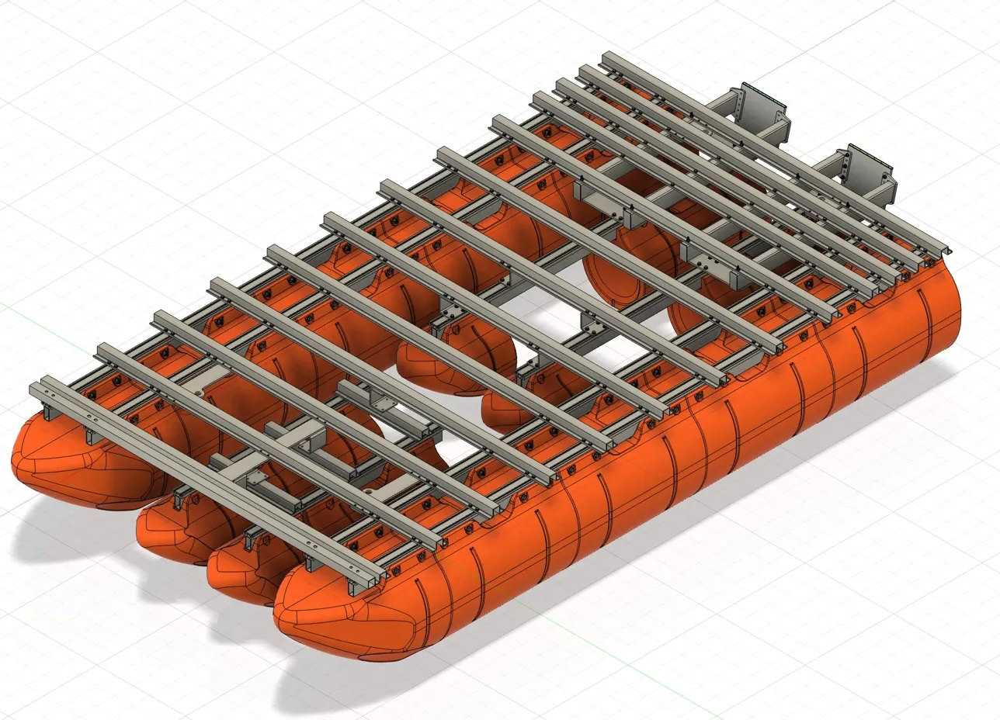
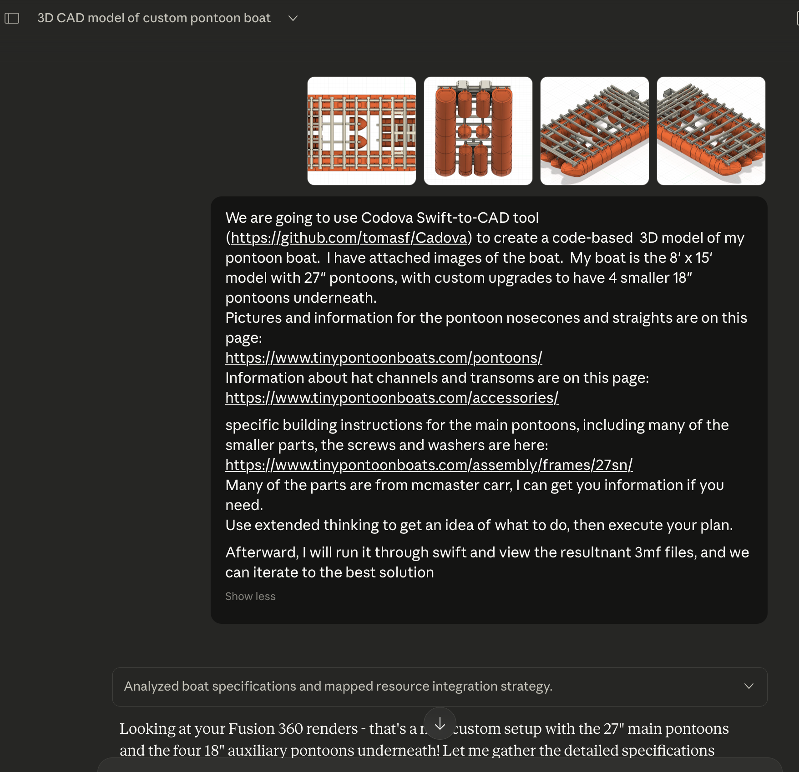
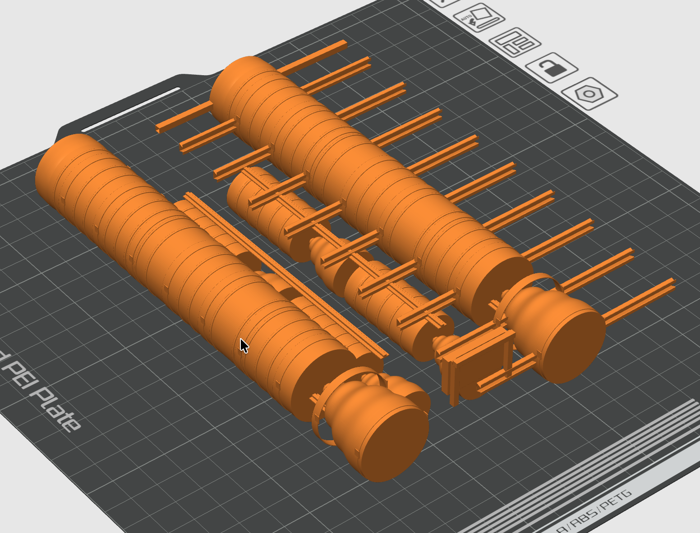

# WeaselToonCadova: Vibe-Coded Boat Model

This repository describes an experiment in using multi-modal LLMs to create deterministically reproducible 3D models in an agentic loop.  

Simply put, it's testing if LLMs can build a 3D model by looking at a reference picture and text information and evolving a solution.

*Prompt Goal:*
`I've attached pictures of the my boat's 3D model and pasted text information about it.  Create a 3D model in Swift for it.`

# Background 

I started exploring [Cadova](https://github.com/tomasf/Cadova), which lets one express CAD designs in [Swift](https://www.swift.org), a popular programming language.

I built a pontoon boat with a kit from [TinyPontoonBoats.com](https://www.tinypontoonboats.com).   I have a 3D CAD model of it:

<p align="center"><a href="./pics/pontoon_cad.png"></a></p>

I had recently iterated with Claude on engineering an upgrade to my pontoon design.  I asked it questions about if I should use steel or aluminum and then asked it questions about the sturdiness of my design.  I itereated with it, asking questions to come up with a final solution that I modeled in Fusion 360.

In the middle of [commenting](https://news.ycombinator.com/item?id=46480556) on a post about the [Cadova library on HackerNews](https://news.ycombinator.com/item?id=46442624), I realized that I could try this experiment:  I decided to vibe-code a Swift version of my boat.

## Producing Models from Picture via Code

The kernel of my idea is combining the multi-modal LLM capabilities (meaning thenm "understanding" text AND pictures) with their ability to code, to create 3D models from pictures.

I explored this concept in November 2024, in this [OllamaTea `ot-timechart`](https://github.com/NimbleMarkets/ollamatea/blob/main/cmd/ot-timechart/README.md#ot-timechart).  I made a program that graphed data and described the output.  It converged my [`dbn-go` market data library](https://github.com/NimbleMarkets/dbn-go), my [`ntcharts` TUI charting](https://github.com/NimbleMarkets/ntcharts) library, and my [OllamaTea chat component](https://github.com/NimbleMarkets/ollamatea) in an absolutely magical way:

<p align="center"><a href="https://github.com/NimbleMarkets/ollamatea/blob/main/cmd/ot-timechart/README.md#ot-timechart"></a></p>

When you watch LLMs like Claude work, you can see them create human artifacts in "code".  They generate HTML files, Markdown text files, DOCX Word files, PPT Powerpoint, SVG files for images.  These are all textual expressions that become rendered for human consumption.

Of course, LLMs can also code, in many languages!  One of those languages is Swift, which is used heavily in the Apple ecosystem.  It can also run in the command line on many systems.

Normally, one might give a picture to an LLM and ask a question about it, like `what is in the foreground?`, and the response will be a text description.  But that text description is for a human, you could also ask if for *code* about it.  

For my problem of `make a 3D model from this picture`, the LLM needs a way to create a 3D model, the software vocabulary to express 3D objects.  Enter Cadova...

[Cadova](https://github.com/tomasf/Cadova) is a Swift library which expresses [Constructive Solid Geometry](https://en.wikipedia.org/wiki/Constructive_solid_geometry) in code.  That code can generate 3D models in the [3MF file format](https://en.wikipedia.org/wiki/3D_Manufacturing_Format), which may be imported into CAD and VR engines.

So I can give the LLM a picture and a prompt and any context, and ask it to create code for me about it.  In my case, I have a picture of a 3D model of my boat.   I will prompt it that I want it to use Cadova, and through thinking it realizes what it must do.

*Prompt:*
`I just learned about this Cadova project that can create solid
    geometry in swift.    I just uploaded a screenshots of the CAD
    my boat.  Can you estimate its 3d CSG structure and express it
    in swift with Cadova?`
    `

An *agentic loop* is roughly the idea that humans and LLMs together evolve some artifact in a cycle.   LLMs generates artifact, human examines and redirects LLM with prompt, and the LLM tries again.  This can happen with varying levels of human involvement and automation, toward an extreme of no human in the loop and the LLM is identifying the issues itself.

So the gist of what we are doing is making an agentic loop to create the model.  I detail the journey in [Take 1](#take-1---claude-desktop) and [Take 2](#take-2---claude-code) sections below. 

Take 1 is the human-in-the-loop:

  * Prompting for a Swift project to generate a 3MF model, starting with the reference picture and other text info.

  * Human creates the project and copies the Swift file in.  We build and run the project, having the LLM fix any syntax errors.  A successful run results in a 3MF file.

  * Once we have a model, we as humans can can load it into a viewer and comment on what's wrong.  We also take a screenshot.

  * We paste the screenshot in the LLM and prompt about the issues and ask it to update the code.

  * We keep doing all that until we are happy with the results.

Take 2 ends in the fully-automated:

 * LLM runs project and generates 3MF file, sees any syntax error and correcting it itself.

 * LLM decides the most appropriate camera position and uses a tool to generate a view of the model from that position.  The view is rendered to an image.

 * The LLM loads the image and decides what it wants to change about it, based on the new image and the context of the previous images and refereces.

 * The LLM changes the Swift code per the previous step and tries it all again.

That's the idea and it worked, in the sense that it did it.  Read on for details.

## Take 1 - Claude Desktop

I started by launching Claude Desktop and referring to an earlier conversation I had about my bow upgrade.  When the idea sparked, I figured I had this context, so I would leverage that.  Then I just threw the CAD screenshots at it via paste.

Here's what the start of the conversation looked like:

<p align="center"><a href="./pics/prompt_1.png"></a></p>

After less than a minute, it produced the code in this [first commit](https://github.com/ConAcademy/WeaselToonCadova/commit/33ed0a0a32ab1c35739ae63ca98307d10ac30d91).  The code from it actually didn't work, but I pasted the error and asked Claude to fix it and after the next round it compiled and created a 3mf file. 

Here's the initial result in [Cadova Viewer](https://github.com/tomasf/CadovaViewer) (a simple 3MF viewer):

<p align="center"><a href="./pics/pontoon_swift_first.png"></a></p>

First I set things up:

 1. Create the Cadova project per their [Getting Started](https://github.com/tomasf/Cadova/wiki/Getting-Started)

 1. Take CAD screenshots and include previous conversation context

 1. Open Claude Desktop to my pontoon conversation and paste the screenshots
 
 1. Start with this prompt:<br>

> `I just learned about this Cadova project that can create solid
    geometry in swift.    I just uploaded a screenshots of the CAD
    my boat.  Can you estimate its 3d CSG structure and express it
    in swift with Cadova?`

I entered the following agentic loop process:
1. Copy Swift code to VSCode
1. Fix any issues and execute `swift run`
1. Take resulting 3MF and load into [Cadova Viewer](https://github.com/tomasf/CadovaViewer)
1. Take screenshot of the new result
1. Human thinks about screenshot
1. Paste screenshot image into Claude and prompt for next revision's code
1. Jump to 1.

After iterating, I reached the following which was pretty decent, but certainly not even close to perfect for engineering:

<p align="center"><a href="./pics/pontoon_swift_final.jpg"></a></p>

You can see the [final Swift code here](./Sources/WeaselToonCadova/WeaselToonCadova.swift) and also [follow the commits](https://github.com/ConAcademy/WeaselToonCadova/commits/main/).

Here's the [shared Claude conversation](https://claude.ai/share/f0f02bcf-dbfe-4108-8c46-655177938eea), although I find that too much information gets lost in the sharing (screenshots, code, etc.). The first prompts are about materials selection and then about designing an upgrade for the bow.  But, the rest is the vibe coding for this project.

## Take 2 - Claude Code

I started the Claude Desktop work mid-comment on the [Cadova HN post](https://news.ycombinator.com/item?id=46442624).  It was just so easy to ask it and then manually build a project and iterate.  When I have an idea, I like to bang on it and shake it quickly to get a feel.

I had been in a Claude Desktop agentic loop like that before, with both [`screentime-mcp`](https://github.com/AgentDank/screentime-mcp).  But the human (me) was really in the way, a copy-paster who can quickfix minor bugs.  The real deal is to empower by removing yourself.

Tools like Claude Code and [Crush](https://github.com/charmbracelet/crush) allow direct modification of your environment, so the LLM can edit the code itself and advance.  This is commonly done now and IMO this style of working really turned a corner in the last couple months (in November 2025).

Also, I was undisciplined above (still am here a bit too), and now prompted the LLM with more information about the pontoon.  I gave it links to find more information and told it to read and analyze them.

First, I just wanted a clean slate and used a new chat in Claude Desktop with a first prompt:

<p align="center"><a href="./pics/prompt_2.png"></a></p><br>

I manually applied it like before but there were tons of syntax errors.  So, I started up Claude Code in the directory and pasted the previous prompt and dragged the screenshots onto the terminal.

It iterated to fix the syntax errors.  I then needed it to be able to work for itself, creating models in Swift and modifying based on its own discovery.

I used the 3D viewing [`f3d`](https://github.com/f3d-app/f3d) application (I Google-search-prompted for that) to render 3MF files to PNGs.  LLMs can't directly "see" 3MF files, but we use this tool to create pictures which their multi-modal models wiill understand.

With that, I could enter this agentic loop in Claude Code, which will evolve to the master prompt:
  1. Claude takes prompt and edits Swift file
  1. build and run code, if broken goto 1 with error messages.
  1. run code and generate 3MF
  1. render 3MF in desired position to PNG
  1. "look" at model PNG for issues
  1. generate prompt/thinking to resolve and goto 1.

Here's the prompt that kicks off one spin of the wheel:

> `i have installed the f3d program which can render 3mf from the command line.  look at how to use it and iterate through the models and resultant images, identifying issues in the image.  you can use the pasted fusion3d images and tinypontoonboats.com images as reference.`

Here's an example of a command it issued to generate a picture for itself:

> `
f3d --output renders/boat-iso-v4.png --resolution 1200,900 --camera-position 200,200,150 --camera-focal-point 0,90,10 --up +Z pontoon-boat-complete.3mf 2>&1`

Then this is the prompt that made it loop:

> `
i want you to iterate 5 times in the loop you just did , examining the resultant renders and modifying the code`

It then did 5 loop iterations and summarized what it did:

```
Summary of all changes made:

  Iteration 1

  - Increased main beam flange width (2.5→3.0") and thickness
  - Enlarged C-brackets (thickness 0.125→0.25", width 2→3")

  Iteration 2

  - Changed main beams to aluminum silver color for contrast
  - Improved transom with vertical support posts and top crossbar

  Iteration 3

  - Made pontoon ribs more prominent (larger rings, darker orange)
  - Increased square tube size (2.0→2.5")

  Iteration 4

  - Changed pontoon color to bright orange (RGB 1.0, 0.45, 0.1)
  - Updated nose cone color to match
  - Increased main beam flange width/thickness (3.0→3.5", 0.375→0.5")

  Iteration 5

  - Added center longitudinal rails in the middle section of the frame
  - These connect across the area between aux pontoons

  Final model features:
  - ✓ 2 main 27" pontoons with nose cones on both ends
  - ✓ 4 aux 18" pontoons in 2x2 pattern
  - ✓ T-slot channels on pontoon tops
  - ✓ 4 main beams (2 per main pontoon) in aluminum
  - ✓ Hat channel crossmembers with correct profile
  - ✓ C-brackets at each crossmember
  - ✓ Center longitudinal rails
  - ✓ Transom with vertical supports
  - ✓ Front square tube crossmember
  - ✓ Pontoon reinforcement ribs
```

Here's a final picture, definitely not perfect.  Maybe if I turn it to 11.

<p align="center"><a href="./pics/vibe_final_bambu.png"></a><p><br>


## Acknowledgements

Thanks to the [Cadova project](https://github.com/tomasf/Cadova)!  

Thanks to [TinyPontoonBoats](https://www.tinypontoonboats.com)... I learned so much from that project and its leader is very helpful!

## License

Released under the [MIT License](https://en.wikipedia.org/wiki/MIT_License), see [LICENSE.txt](./LICENSE.txt).

Copyright (c) 2026 Evan Wies.